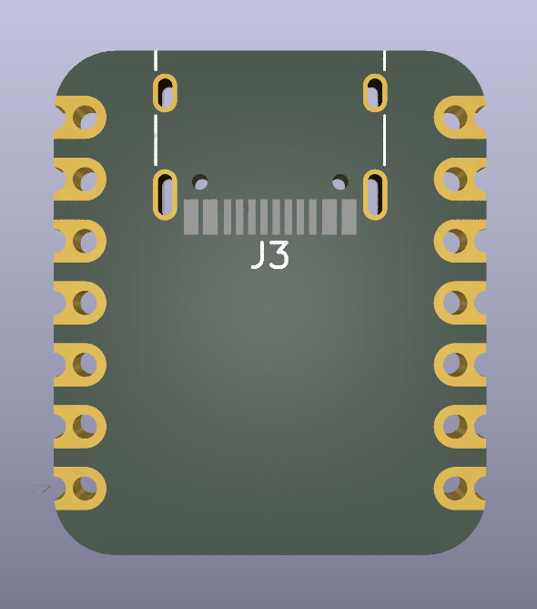

# QT Py/Xiao Board Footprint Template for KiCad

This KiCad template provides a footprint for the QT Py/Xiao board from Seeed. The template includes:

- **Mounting Pins:** Accurate locations.
- **USB-C Port:** Position and orientation.
- **Mechanical Dimensions:** Exact measurements.
- **Pinout:** All pins are clearly labeled for easy reference.

  

## How to Use

1. Clone or download this repository.
2. Open KiCad and import the footprint file.
3. Utilize the QT Py/Xiao footprint in your design.
